# 📱 Aplikasi Sewa Perlengkapan Resepsi Pernikahan

Aplikasi ini merupakan aplikasi mobile berbasis **Android** yang digunakan oleh klien untuk melakukan pemesanan (booking) penyewaan perlengkapan resepsi pernikahan.  
Aplikasi dikembangkan menggunakan teknologi **React Native** dengan bantuan **Expo**.

---

## 📦 Teknologi

- React Native
- Expo
- Axios (untuk komunikasi dengan API Laravel)
- AsyncStorage (untuk menyimpan token login)
- React Navigation

---

## 🚀 Fitur Aplikasi

- **Login & Registrasi**  
  Pengguna dapat melakukan login jika sudah terdaftar. Apabila belum memiliki akun, pengguna dapat melakukan registrasi terlebih dahulu melalui halaman registrasi.

- **Halaman Beranda**  
  Pada halaman ini, pengguna dapat melihat daftar katalog atau perlengkapan resepsi pernikahan yang tersedia untuk disewa. Pengguna juga dapat memilih salah satu katalog untuk melihat informasi detail dari perlengkapan tersebut.

- **Halaman Keranjang**  
  Halaman ini menampilkan daftar katalog yang telah dipilih oleh pengguna dari halaman beranda.  
  Pengguna dapat mengisi dan melihat informasi detail penyewaan, seperti tanggal mulai dan tanggal berakhir sewa, alamat pengiriman, serta catatan tambahan jika diperlukan.  
  Selain itu, halaman ini juga menampilkan informasi katalog yang dipilih beserta total harga sewa.  
  Terdapat tombol **Cek Ketersediaan** untuk memastikan stok katalog tersedia pada tanggal yang dipilih, serta tombol **Buat Pesanan** untuk melakukan proses checkout atau pembayaran.  
  Setelah tombol **Buat Pesanan** ditekan, pengguna akan diarahkan ke halaman pembayaran melalui payment gateway **Midtrans**.

- **Halaman Riwayat**  
  Pada halaman ini, pengguna dapat melihat riwayat transaksi yang pernah dilakukan. Pengguna juga dapat melihat detail transaksi dengan memilih salah satu data dari daftar riwayat.  
  Pada halaman detail riwayat pesanan, pengguna dapat melihat status pesanan serta status pembayarannya.

- **Halaman Profil**  
  Halaman ini menampilkan informasi akun pengguna. Selain itu, tersedia tombol **Logout** untuk keluar dari aplikasi.
  
---

## ⚙️ Cara Instalasi & Menjalankan Aplikasi

Berikut langkah-langkah untuk menjalankan proyek React Native (Expo):

### 1. Clone Repository

```bash
git clone https://github.com/Mhmmadlthfi/sewa-perlengkapan-nikah-mobile.git && cd sewa-perlengkapan-nikah-mobile
```

### 2. Install Dependencies

```bash
npm install
```

> Pastikan Anda sudah menginstal [Node.js](https://nodejs.org/) dan [Expo CLI](https://docs.expo.dev/get-started/installation/), jika belum, Anda bisa menginstalnya dengan:
>
> ```bash
> npm install -g expo-cli
> ```

### 3. Jalankan Proyek

```bash
npx expo start
```

Aplikasi akan terbuka di browser dengan QR code.

### 4. Jalankan di Perangkat Android

- Buka aplikasi **Expo Go** di Android Anda (Gunakan Expo go untuk SDK 5.3)
- Scan QR code yang muncul di terminal atau browser.

> ⚠️ Aplikasi ini saat ini **belum dibuild ke APK**, dan hanya bisa dijalankan secara lokal menggunakan Expo Go.

---

## 📸 Cuplikan Layar

**Halaman Login & Registrasi**

<p align="center">
    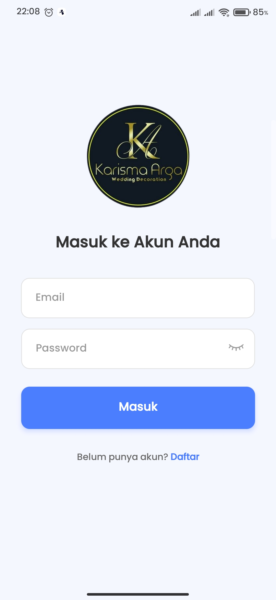
    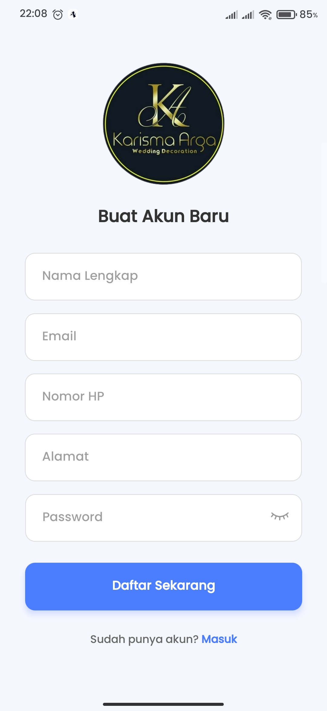
</p>

**Halaman Beranda**

<p align="center">
    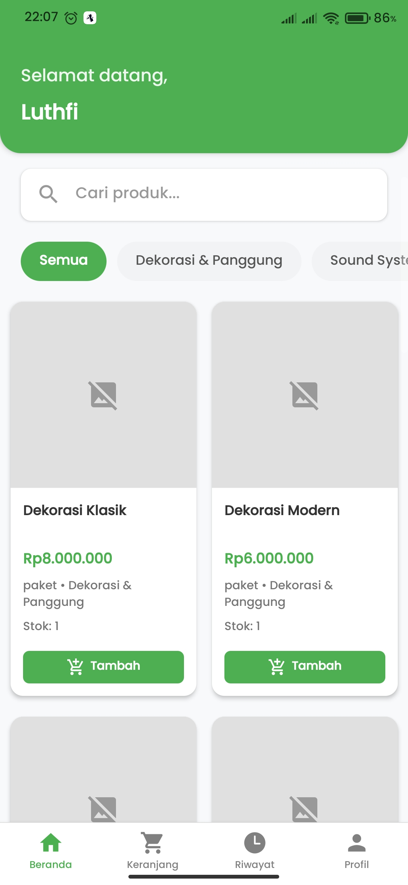
</p>

**Halaman Detail Katalog**

<p align="center">
    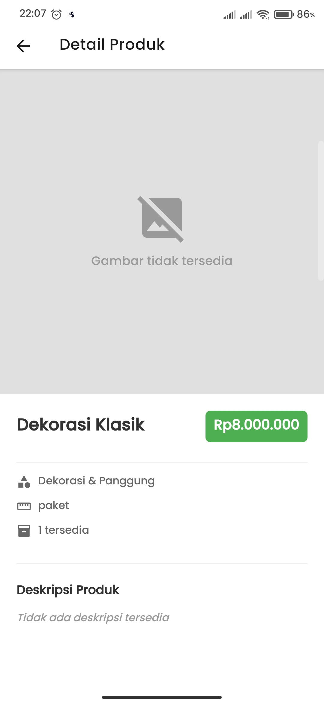
</p>

**Halaman Keranjang**

<p align="center">
    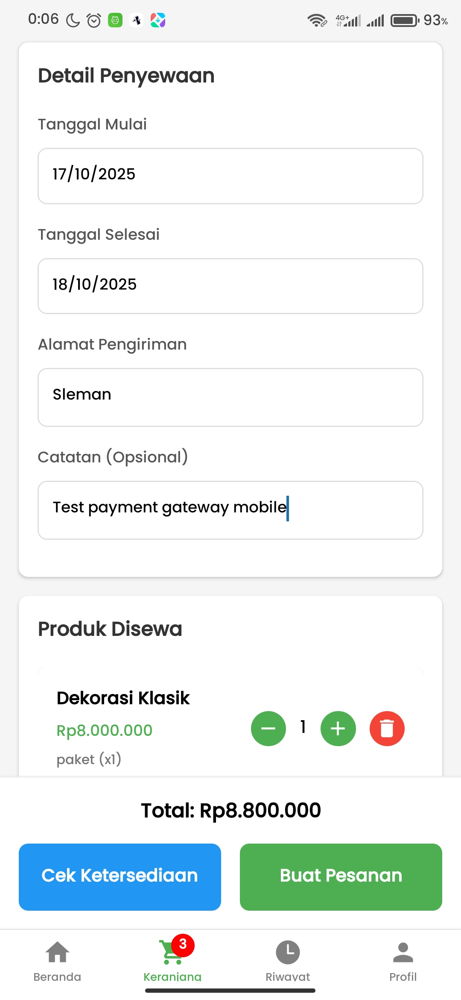
    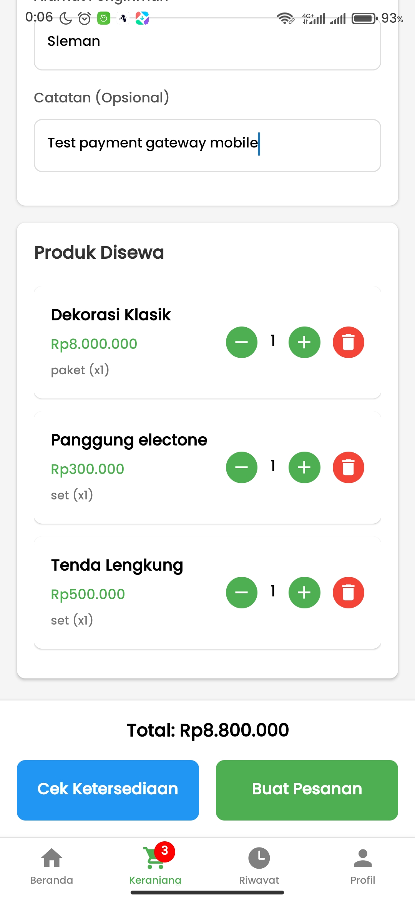
</p>

**Halaman Pembayaran (Midtrans - Payment Gateway)**

<p align="center">
    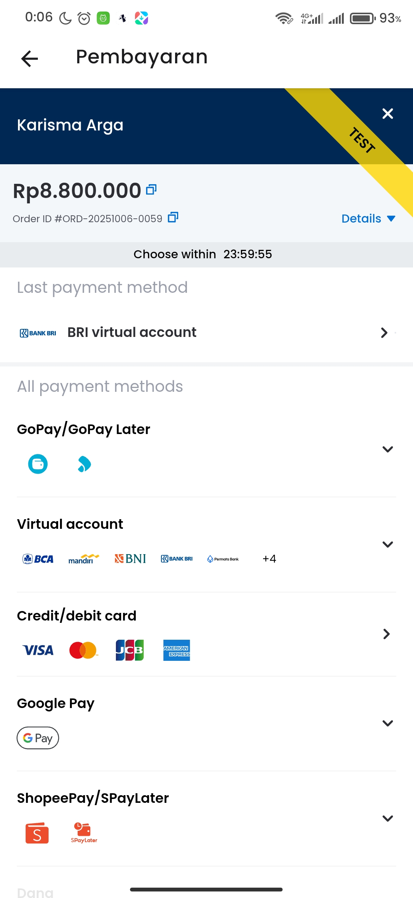
    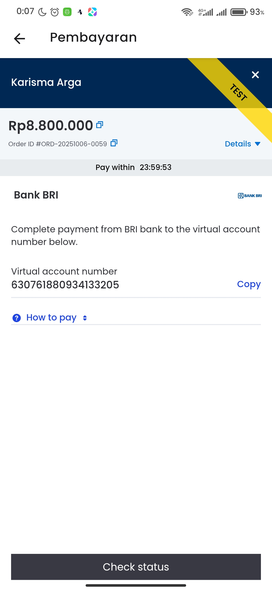
    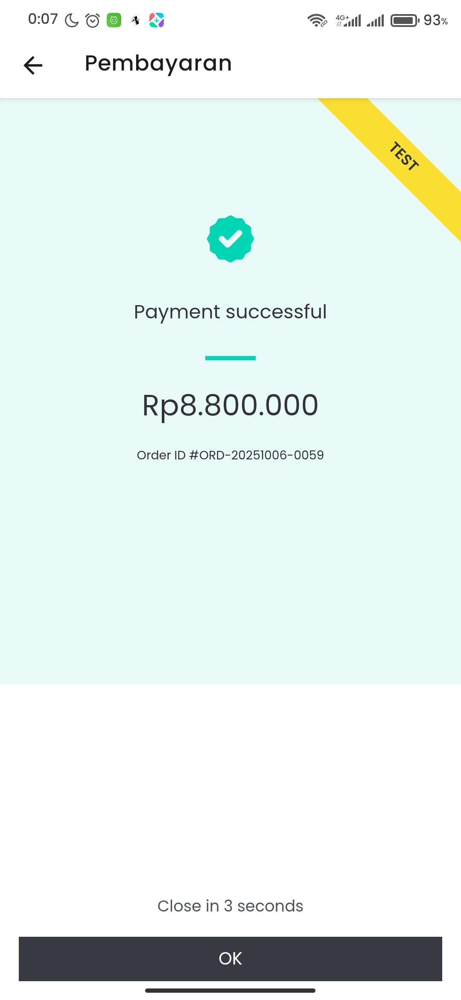
</p>

**Halaman Riwayat**

<p align="center">
    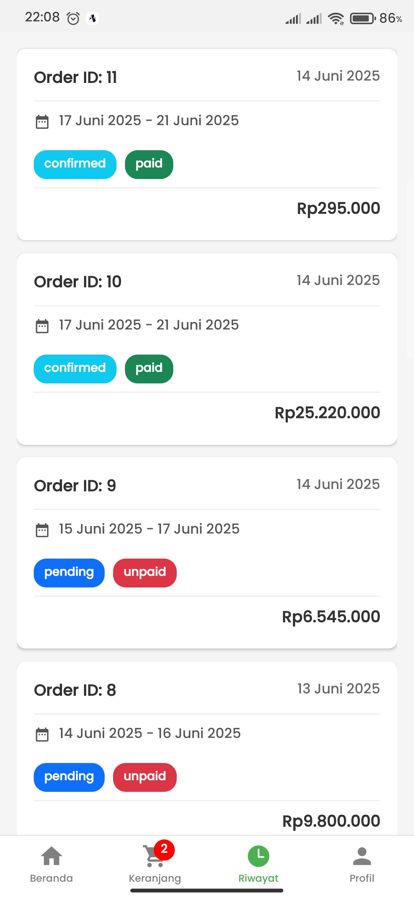
</p>

**Halaman Detail Riwayat**

<p align="center">
    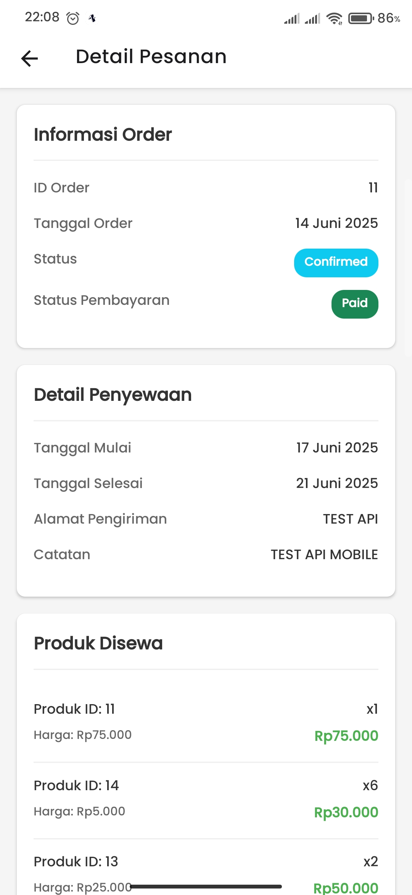
    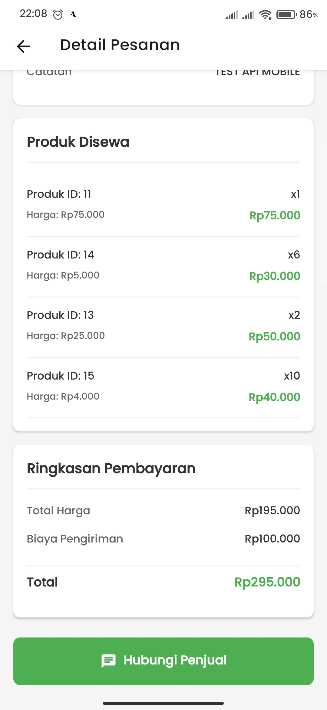
</p>

---

## ℹ️ Informasi Tambahan

- Token disimpan secara lokal menggunakan AsyncStorage.
- Jika logout, token akan dihapus dan pengguna kembali ke halaman login.
- Tidak tersedia halaman registrasi atau reset password dari aplikasi.

---

## 🔗 Tautan Terkait

- 🔗 Backend Laravel: [https://github.com/Mhmmadlthfi/Sewa-perlengkapan-nikah.git](https://github.com/Mhmmadlthfi/Sewa-perlengkapan-nikah.git)
---
